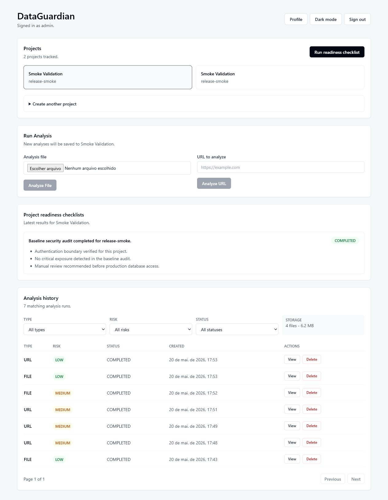

# DataGuardian


DataGuardian is a local-first security inspection platform for suspicious files
and URLs. It is built to answer a practical question: how do you let a user
inspect untrusted content before deciding whether to download or open it?

The current release focuses on the production foundations that matter first:
secure authentication, deterministic local execution, automated validation,
dependency hygiene, and a clear path from developer laptop to CI.

## Project Status

MVP stable release candidate (under active development)

Core features are functional:
- File analysis (PDF, images)
- URL analysis (safe remote inspection)
- Metadata extraction and classification
- Deterministic findings and risk scoring
- Metadata-cleaned sanitized file generation and authenticated download

Known limitations:
- Sanitized files remove selected metadata only; they are not a malware removal
  or full content-disarm guarantee.
- Stored analysis files remain available for history and downloads. Startup
  cleanup removes only old unreferenced storage files.

## What DataGuardian Does

### Safe demonstration files

The repository includes a deterministic, non-malicious corpus under `samples/`. It contains clean files, inert suspicious markers stored only in comments/metadata, and deliberately rejected MIME/extension cases. See [`samples/README.md`](samples/README.md) before use. Regenerate or verify it with `python3 scripts/generate_safe_samples.py --check`.

DataGuardian lets you sign in, upload a supported file or submit a URL, and get
a local security-oriented analysis before you decide whether to trust it. It
shows a static safe preview when possible, metadata, deterministic findings,
risk score, explanations, and, for supported files, a sanitized copy with some
metadata removed.

DataGuardian is a passive inspection utility. It does not execute uploaded
files, detonate malware, render remote websites interactively, or replace
professional sandboxing and incident-response tools.

DataGuardian is Docker-first. You do not need to install Go, Node.js, or
PostgreSQL just to try the app. Docker starts the database, backend, and
frontend together.

Important sanitized-file warning: a sanitized copy has selected metadata
removed. It does NOT guarantee that the file is safe, malware-free, or fully
disarmed.

Important safe-preview warning: previews are static and read-only. Active file
content, PDF JavaScript, website JavaScript, DOM behavior, and browser rendering
are intentionally not executed.

## Release Readiness Notes

Supported uploads: PDF, JPEG, PNG, and plain text up to 10 MB.
Supported safe previews: static JPEG/PNG images, plain text, and static PDF
image previews. URL inspection is passive HTTP/HTTPS fetching only.

DataGuardian stores original and sanitized analysis files so authenticated users
can revisit results and download artifacts. On backend startup, unreferenced
files older than `STORAGE_ORPHAN_RETENTION_HOURS` are removed; the default is
24 hours. Set it to `0` to disable orphan cleanup. Referenced analysis artifacts
remain available until the signed-in owner deletes the analysis.
Docker keeps PostgreSQL data and stored analysis files in named volumes. Use
`docker compose down -v` only when you intentionally want to remove that local
state.

## Start Here

### Desktop shortcuts

- Windows: `powershell -ExecutionPolicy Bypass -File .\scripts\desktop-shortcut.ps1 install`
- Linux: `./scripts/desktop-shortcut.sh install`
- macOS: `./scripts/desktop-shortcut-macos.sh install`

Replace `install` with `remove` to uninstall. Shortcuts run the existing Docker-first launcher, require no administrator privileges, and never install Docker automatically. Linux/macOS users can also run `./scripts/manage.sh` for start, stop, status, logs, and shortcut actions.

| Platform | Supported runtime | Shortcut validation |
|---|---|---|
| Windows 10/11 | Docker Desktop, amd64/arm64 as provided by Docker | PowerShell helper; manual Windows validation recommended |
| macOS Intel/Apple Silicon | Docker Desktop | Shell syntax validated; manual macOS validation recommended |
| Linux amd64/arm64 | Docker Engine and Compose | Automated user-local shortcut test |

Support means the Docker-first workflow is designed for these environments; it is not a claim that every distribution or hardware combination has been tested.

The frontend exposes an installable web-app manifest, but intentionally has no service worker. Authenticated responses, analyses, previews, files, and personal data are therefore not cached for offline use, and background sync/push are not enabled.

### Requirements

- Docker with Docker Compose.
- Git, so you can run `git clone`.
- A terminal app.
- A web browser.
- Optional helper scripts and smoke validation also need `curl`.

If `git` is not installed, install it from <https://git-scm.com/downloads> or
use the package manager for your operating system.

### Beginner Start

After cloning or downloading the repository, start with `START-HERE.txt` if you
want the shortest path. If you downloaded a ZIP, extract it first.

DataGuardian is Docker-first. The primary startup path is the explicit Docker
Compose command below. Docker must already be installed and running.

Windows PowerShell, Linux, or macOS:

```bash
docker compose up --build
```

Optional helper launchers are also included for users who prefer a guided
wrapper after Docker is already running:

```text
Windows: double-click start-dataguardian.bat
Linux/macOS: ./start-dataguardian.sh
```

The app is available at:

```text
http://localhost:3000
```

Local demo users:

```text
admin / admin123
test  / test123
```

The first startup can take a few minutes while Docker builds the backend and
frontend images.

The launchers check Docker, print and run the normal Docker Compose startup
commands in this folder, wait for readiness, and ask before opening your
browser. They do not install services, start Docker Desktop, change system
settings, or replace Docker as the runtime.

For portable ZIP downloads, keep the launcher files in the project folder.
Beginner-facing files are `START-HERE.txt`, `start-dataguardian.bat`,
`start-dataguardian.sh`, and `README.md`. Runtime and source folders such as
`backend-go/`, `frontend/`, `scripts/`, and `security/` should be left in place.

For maintainers and reviewers, `./scripts/release-check.sh` verifies release
file presence, shell syntax, and Docker Compose configuration without starting
the stack. After startup, `./scripts/smoke.sh` can verify login plus a small
file and URL analysis. These checks are optional for normal users.

### Docker Command Start

After cloning or extracting the repository, start everything with:

```bash
docker compose up --build
```

When the services finish starting, open:

```text
http://localhost:3000
```

Docker starts PostgreSQL, the Go backend, and the Next.js frontend together.
No Go, Node.js, Python, or PostgreSQL install is required for normal use.

### Linux Users

1. Install Docker.
   - Docker Desktop for Linux: <https://docs.docker.com/desktop/setup/install/linux/>
   - Docker Engine for Linux: <https://docs.docker.com/engine/install/>
2. Open a terminal.
   - Ubuntu/GNOME: press `Ctrl` + `Alt` + `T`.
   - Or open the app menu and search for `Terminal`.
3. Clone the repository:

```bash
git clone https://github.com/joaosalero/dataguardian.git
cd dataguardian
```

4. Start DataGuardian:

```bash
docker compose up --build
```

5. Open:

```text
http://localhost:3000
```

6. Stop DataGuardian when finished:

```bash
docker compose down
```

### Windows Users

1. Install Docker Desktop for Windows:
   <https://docs.docker.com/desktop/setup/install/windows-install/>
2. Start Docker Desktop from the Start menu and wait until it says Docker is
   running.
3. Open a terminal.
   - Press `Windows`, type `PowerShell`, and open Windows PowerShell.
   - Git Bash also works if you installed Git for Windows.
4. Clone the repository:

```powershell
git clone https://github.com/joaosalero/dataguardian.git
cd dataguardian
```

5. Start DataGuardian:

```powershell
docker compose up --build
```

6. Open:

```text
http://localhost:3000
```

7. Stop DataGuardian when finished:

```powershell
docker compose down
```

### macOS Users

1. Install Docker Desktop for Mac:
   <https://docs.docker.com/desktop/setup/install/mac-install/>
2. Start Docker Desktop from Applications and wait until Docker is running.
3. Open a terminal.
   - Press `Command` + `Space`, type `Terminal`, and press `Enter`.
4. Clone the repository:

```bash
git clone https://github.com/joaosalero/dataguardian.git
cd dataguardian
```

5. Start DataGuardian:

```bash
docker compose up --build
```

6. Open:

```text
http://localhost:3000
```

7. Stop DataGuardian when finished:

```bash
docker compose down
```

The developer helper script also works on Linux and macOS:

```bash
./start.sh manual
```

It prints service readiness, the app URL, backend health URL, and local demo
users before following backend/frontend logs. It requires `curl`; if `curl` is
not installed, use `docker compose up --build` directly.

After startup, run the release smoke check:

```bash
./scripts/smoke.sh
```

On Windows, run the same command from Git Bash, or use the Docker and browser
checks listed below from PowerShell.

### Startup Recovery

If startup fails:

- Docker not installed: install Docker Desktop, then run
  `docker compose up --build` again.
- Docker not running: open Docker Desktop yourself and wait until it says
  Docker is running. DataGuardian does not start Docker Desktop automatically.
- Ports busy: DataGuardian uses ports `3000`, `8000`, and `5434`. On Linux or
  macOS, run `./scripts/doctor.sh` to inspect them. On Windows, close the other
  app using the port and rerun `docker compose up --build`.
- Stack started but app did not open: visit `http://localhost:3000` manually.
- Health check failed: inspect logs with `docker compose logs backend-go frontend`.
- Smoke check failed: restart the stack, confirm `http://localhost:3000` opens,
  then rerun `./scripts/smoke.sh`.
- Release check failed: make sure the ZIP was fully extracted and required
  files such as `START-HERE.txt`, `README.md`, and `docker-compose.yml` are
  still present.

Restart without deleting local data:

```bash
docker compose down
docker compose up --build
```

On Windows, run both commands in PowerShell.

Reset local data only when you intentionally want to remove the local database
and stored analysis files:

```bash
docker compose down -v
```

### Portable Release Notes

A future downloadable ZIP should keep the repository layout intact and include
the root launcher files, `START-HERE.txt`, `README.md`, `docker-compose.yml`,
`backend-go/`, `frontend/`, `scripts/`, and `security/`. It should not include
local runtime state such as `.env`, `.venv/`, `node_modules/`, `.logs/`, Docker
volumes, or build caches.

### Dashboard Walkthrough

1. Open `http://localhost:3000`.
2. Create an account, or sign in with a local demo user:

```text
admin / admin123
test  / test123
```

3. The dashboard creates a default project automatically if you do not have
   one.
4. To analyze a file, choose a PDF or JPEG in `Analysis file`, then select
   `Analyze File`.
5. To analyze a URL, type an `http` or `https` URL, then select `Analyze URL`.
6. Open `Analysis history` and select `View` to inspect findings, metadata,
   explanations, risk score, and sanitized-file details.
7. Use `Download Original` only after reviewing the warning and findings. If a
   sanitized file is available, use `Download Sanitized Copy` for the
   metadata-cleaned copy. Sanitized copies are not malware removal.

### Screenshots



The dashboard includes passive analysis, risk review, static previews, metadata-only sanitized copies, local JSON/PDF report export, profile visibility, and a persistent dark theme.

Screenshots are planned for the public README:

- Login and registration
- Dashboard and analysis history
- Safe preview and findings
- Original vs sanitized download panels

### Tests For Users

Run the main automated checks:

```bash
./run-tests.sh
```

Run the Docker health validation:

```bash
docker compose up --build validation
```

Install optional browser test tooling:

```bash
./scripts/install.sh
```

Run browser E2E tests after the app is running:

```bash
.venv/bin/pytest tests/e2e/test_full_flow.py
```

Run the visual browser E2E test:

```bash
.venv/bin/pytest tests/e2e/test_full_flow.py -s --headed --slowmo 300
```

## Product Perspective

DataGuardian is aimed at engineers, security-minded teams, and technical
reviewers who need confidence that a system handling audit data can be started,
tested, inspected, and extended without hidden setup steps.

In a real security product, the first risk is rarely the dashboard. It is weak
authentication, unclear runtime boundaries, unmanaged dependencies, leaked
configuration, and tests that only work on one machine. This project prioritizes
those fundamentals before expanding into larger audit workflows such as RBAC,
tenant isolation, immutable audit events, or deployment automation.

## Engineering Narrative

DataGuardian began as a broader Python-backed prototype and was consolidated
around a Go backend for the active runtime. That migration is intentional: the
project now has one backend source of truth, one Docker runtime path, and one CI
contract.

Go is used for the backend because it fits the shape of the problem:

- Strong static typing for authentication and configuration boundaries.
- Small operational footprint for API services.
- Clear standard-library HTTP behavior.
- Good concurrency and timeout primitives for future audit workloads.
- Straightforward container execution with predictable builds.

Docker Compose is the default runtime because reproducibility is part of the
product. A reviewer should be able to start PostgreSQL, the API, and the
frontend with one command and see the same service topology used by the scripts.

Python remains intentionally optional. It is used only for pytest and Playwright
browser E2E tests. The application, backend, frontend, Docker stack, and core
test bundle do not require Python to run.

## Architecture

```text
Browser
  |
  v
Next.js frontend  --->  Go HTTP API  --->  PostgreSQL 15
                              |
                              v
                    Security middleware and auth
```

Active runtime services:

- `db`: PostgreSQL 15
- `backend-go`: Go API
- `frontend`: Next.js application

The Go API handles registration, login, session validation, logout, project
tracking, baseline audit runs, local dev/test bootstrap users, and PostgreSQL
persistence. The frontend provides login, registration, an authenticated
dashboard, automatic default project selection for new users, optional project
creation, audit execution, audit results, and session-aware navigation.

The legacy Python implementation is not part of Docker, CI, startup scripts, or
the active runtime.

## Security Mindset

Additional hardening includes CSRF/Fetch Metadata checks, bounded JSON and upload inputs, MIME/extension consistency, trusted connection IP rate limiting with expired-key cleanup, restricted URL destination ports, redirect-by-redirect SSRF validation, and versioned schema migrations.

Security is treated as a workflow property, not a README claim.

- Passwords are hashed with Argon2id.
- Sessions use HttpOnly RS256 JWT cookies.
- JWT validation requires expected claims and rejects unexpected signing
  methods.
- Production configuration requires explicit database URL, JWT keys, and
  encryption key.
- Production requests require HTTPS or trusted proxy forwarding.
- Login and registration are rate limited.
- Backend and frontend responses set basic hardening headers.
- `npm audit --audit-level=high` checks frontend dependency risk.
- `security/run_security_checks.sh` scans for obvious secret exposure and
  verifies `.env` is ignored.
- `security/audit.sh` checks runtime responses for sensitive leakage and risky
  headers.
- CI separates backend tests, security checks, and frontend build so failures
  are easier to reason about.

The repository is also structured for CodeQL adoption: active source is
separated by runtime, generated artifacts are ignored, and CI has clear security
gates where code scanning can be added.

## Execution Modes

### Quick Start

Prerequisite: Docker with Docker Compose.

Start the complete system:

```bash
docker compose up --build
```

Open:

```text
Frontend: http://localhost:3000
Backend:  http://localhost:8000
Health:   http://localhost:8000/health
```

The default Docker configuration starts PostgreSQL, the compiled Go backend,
and the production Next.js frontend. Local dev/test users are bootstrapped in
the default `dev` environment:

```text
admin / admin123
test  / test123
```

No `.env` file is required for local use. Copy `.env.example` to `.env` only
when overriding ports, credentials, cookie settings, or public frontend API
URL. For storage hygiene, `STORAGE_ORPHAN_RETENTION_HOURS` controls cleanup of
old unreferenced storage files during backend startup. Invalid integer values,
invalid backend addresses, and unsafe cookie combinations fail during startup
with a configuration error.

### Manual Usage

```bash
./start.sh manual
```

Manual mode starts PostgreSQL, the compiled Go backend, and the production
frontend through Docker Compose. It waits for readiness and then follows
backend and frontend logs.

Open:

```text
Frontend: http://localhost:3000
Backend:  http://localhost:8000
Health:   http://localhost:8000/health
```

Local dev/test users:

```text
admin / admin123
test  / test123
```

These users are created only in `dev` and `test` environments.

### Automated Mode

```bash
./start.sh auto
```

Automated mode runs security checks, starts the Docker stack, runs the runtime
security audit, executes Go backend tests, and runs browser E2E tests only when
pytest is available.

Visual browser mode:

```bash
./start.sh auto --visual
```

### Core Test Bundle

```bash
./run-tests.sh
```

This runs Go tests and the frontend production build. If pytest is installed,
it also runs the architecture contract and browser E2E tests. If pytest is not
installed, E2E is skipped gracefully:

```text
[WARN] pytest not found. Skipping E2E tests.
```

## Setup And Commands

Run the Docker-first stack:

```bash
docker compose up --build
```

Run the Docker health validation service after or during local startup:

```bash
docker compose up --build validation
```

Run the release smoke flow after the stack is up:

```bash
./scripts/smoke.sh
```

The smoke flow checks backend health, frontend availability, login, dashboard
availability, one file analysis, and one URL analysis. It uses the local demo
admin account and a small public IANA example-domain page by default. Override
`SMOKE_USER`, `SMOKE_PASSWORD`, or `SMOKE_URL` only when needed. Start the stack
before running this command; in restricted networks, point `SMOKE_URL` at an
allowed public HTTP/HTTPS URL that passes SSRF protections.

Run the lightweight release preflight before tagging:

```bash
./scripts/release-check.sh
```

This checks required release files, shell helper syntax, and Docker Compose
configuration without starting the stack.

Install frontend dependencies:

```bash
cd frontend
npm ci
```

Start services without following logs:

```bash
./scripts/up.sh
```

`scripts/up.sh` waits for backend/frontend readiness and prints the browser
URL, backend health URL, and local demo users. On Windows, use the Docker
Compose commands from PowerShell instead of the shell helper scripts.

Rebuild after pulling updates:

```bash
docker compose up -d --build db backend-go frontend
```

Restart without rebuilding:

```bash
docker compose restart backend-go frontend
```

Reset local Docker data only when you intentionally want to remove the local
database and stored analysis files:

```bash
docker compose down -v
```

Install optional E2E tooling:

```bash
./scripts/install.sh
```

`scripts/install.sh` creates `.venv/`, installs `pytest` and
`pytest-playwright`, and runs `npm ci` for the frontend. This is useful for
browser E2E development, but it is not required for normal application usage.

Run backend tests:

```bash
cd backend-go
go test ./...
```

Run backend tests through Docker when local Go is unavailable:

```bash
docker compose run --rm backend-go-test go test ./...
```

Run frontend type check:

```bash
cd frontend
npm run test
```

Build frontend:

```bash
cd frontend
npm run build
```

Run optional E2E tests after the stack is running:

```bash
pytest tests/e2e
```

### E2E Testing

The browser E2E test uses pytest and Playwright to exercise the full user flow
against running local services:

- frontend: `http://localhost:3000`
- backend: `http://localhost:8000`

Install the optional Python test tools:

```bash
./scripts/install.sh
```

If installing manually, install pytest and Playwright, then install the browser
runtime:

```bash
python -m pip install pytest pytest-playwright
python -m playwright install chromium
```

Start the stack before running E2E:

```bash
./scripts/up.sh
pytest tests/e2e/test_full_flow.py
```

The test registers a unique user, logs in through the browser, verifies the
default project flow, creates file and URL analyses with the authenticated
browser session, verifies dashboard history and analysis details, checks the
sanitized-file section and download action, then signs out.

Build local backend binaries:

```bash
./scripts/build_go.sh
```

Generated binaries are written under `dist/`, which is intentionally ignored.

## Security Commands

Run dependency, secret, and config checks:

```bash
./security/run_security_checks.sh
```

Run secret-only checks:

```bash
./security/run_security_checks.sh --secrets-only
```

Run runtime exposure audit after services are up:

```bash
./security/audit.sh
```

Inspect ports and Docker state:

```bash
./scripts/doctor.sh
```

## Product API

Authenticated product routes:

- `GET /projects`: list projects for the signed-in user.
- `POST /projects`: create a project with `name` and `target`.
- `GET /projects/{id}`: fetch one project owned by the signed-in user.
- `POST /projects/{id}/audit`: run and store a baseline audit result.
- `GET /projects/{id}/audits`: list audit results for a project.
- `GET /analyses`: list file and URL analysis history for the signed-in user.
  Supports `page`, `pageSize`, `inputType`, `riskLevel`, and `status` query
  parameters. Filtering, ordering, and pagination are applied in the database.
- `POST /analyses`: create a file analysis from a multipart upload, or a URL
  analysis from a JSON body.
- `GET /analyses/{id}`: fetch a completed file or URL analysis result.
- `DELETE /analyses/{id}`: delete an analysis owned by the signed-in user and
  remove associated stored original/sanitized files when present.
- `GET /analyses/{id}/file`: download the original uploaded file, or the
  isolated remote file captured during a URL analysis, when one is available
  for an analysis owned by the signed-in user.
- `GET /analyses/{id}/clean-file`: download the sanitized file for a file
  analysis or remote-file URL analysis when clean-file generation completed.
- `GET /storage`: return admin-only storage usage counts without exposing
  filesystem paths.

The authenticated dashboard shows project audit results and paginated analysis
history. New users get a default project automatically, while manual project
creation remains available for users who need separate project scopes. Analysis
rows include target type, status, risk level, timestamp, view, and delete
actions. Admin users also see a compact storage usage summary. History can be
filtered by file/URL type, risk, and status. Selecting an analysis loads the
existing `GET /analyses/{id}` result and shows summary,
findings, deterministic explanations, metadata, risk score, original file
details, and sanitized file details when available. Deleting an analysis removes
the database record and its stored original/sanitized files after ownership
validation. The Original File panel shows filename, MIME type, size, risk
warning, and a mediated download button. High-risk originals require an explicit
typed confirmation before download and state that passive inspection reduces
exposure but does not guarantee malware detection. Remote-file analyses also
state that the backend inspected the remote content before local download. The
Sanitized File panel shows filename, size, cleaning status, metadata removed,
sanitization limitations, and a separate sanitized-copy download button. The
Safe Preview panel shows a static
image or plain-text preview when one can be generated without executing active
content. The history endpoint is scoped through the signed-in user's projects,
so users only see analyses attached to projects they own. If a browser session
expires, the dashboard redirects to sign-in with a short session-expired
message.

Analysis responses include an explanation layer for each finding. This layer is
template-based and deterministic: it explains findings that already exist,
suggests mitigation, and contextualizes risk. It does not detect
vulnerabilities, change findings, change scoring, execute content, fetch
external data, or call an external AI service. A provider interface exists so a
future LLM-based explainer can be plugged in without changing the detection
pipeline.

Deletion is permanent. Missing artifact files are handled gracefully. Stored
paths are still checked against the configured storage directory before any file
removal is attempted, and unsafe stale references are skipped rather than
followed.

### File Analysis

The file analysis slice supports authenticated uploads.

Example:

```bash
curl -i \
  -X POST http://localhost:8000/analyses \
  -b "dataguardian_session=<session-cookie>" \
  -F "projectId=1" \
  -F "inputType=FILE" \
  -F "file=@sample.pdf"
```

Supported upload types:

- PDF: `application/pdf`
- JPEG: `image/jpeg`
- PNG: `image/png`
- Plain text: `text/plain`

Current limits and behavior:

- Maximum file size is 10 MB.
- Files are stored under the configured `STORAGE_DIR`, defaulting to
  `/tmp/dataguardian/uploads`.
- The backend computes a SHA-256 checksum for every accepted file.
- Minimal analysis scans raw bytes for PDF JavaScript/OpenAction markers,
  base64-like long strings, and `eval(` string patterns.
- Metadata includes filename, MIME type, size, checksum, and lightweight
  file-format metadata.
- PDF metadata extraction currently checks producer, author, creation date, and
  whether embedded-object markers are present.
- JPEG metadata extraction currently checks EXIF camera model, datetime, and
  GPS when present.
- Metadata entries are classified by category and sensitivity. For example,
  GPS is `SENSITIVE`, author/tool fields are `POTENTIALLY_SENSITIVE`, and file
  size is `NON_SENSITIVE`.
- Metadata findings currently include `METADATA_GPS_EXPOSED`,
  `METADATA_AUTHOR_PRESENT`, and `METADATA_SUSPICIOUS_PRESENT`.
- Safe Preview supports static JPEG/PNG image previews, plain-text previews,
  and a first-page PDF static image generated from inert text snippets. It does
  not embed a PDF viewer or execute PDF actions.
- Sanitized file generation creates a metadata-cleaned file record for file analyses.
  JPEG sanitization removes EXIF APP1 segments. PDF sanitization removes a
  small set of non-essential literal metadata fields such as author, producer,
  and creation date.
- `cleanFile` is returned for PDF and JPEG file analyses, including supported
  remote-file URL analyses, when sanitization is recorded. PNG, text, and URL
  responses without a supported remote file return `cleanFile: null`.
- Original files are preserved exactly as uploaded and can be downloaded from
  the analysis details UI or from `GET /analyses/{id}/file`.
- Completed sanitized copies can be downloaded from the analysis details UI or from
  `GET /analyses/{id}/clean-file` with the signed-in user's session cookie.
- Sanitization transparency is shown in the dashboard. EXIF removal is reported
  as EXIF removed, including GPS/location fields when present. PDF metadata
  removal reports author, producer/tool, and timestamp fields when applicable.
  The dashboard also calls out cleanup limits: sanitization removes supported
  metadata only; it does not remove malware, scripts, embedded content, or
  active document behavior.

Security boundary:

- Uploaded files are treated as untrusted binary data.
- Files are not executed, opened in active viewers, or processed by browser PDF
  engines.
- PDF previews are generated as static images only. Embedded PDF JavaScript and
  actions are not executed.
- Sanitization is binary-only and removes metadata; it does not execute content
  or add replacement document content.
- The current sanitized file feature is lightweight metadata removal, not full
  document sanitization or malware removal.
- The current implementation is structured for future sandboxing, but does not
  provide a sandbox yet.

### URL Analysis

URL analysis accepts an authenticated JSON request:

```bash
curl -i \
  -X POST http://localhost:8000/analyses \
  -b "dataguardian_session=<session-cookie>" \
  -H "Content-Type: application/json" \
  -d '{"projectId":1,"inputType":"URL","url":{"originalUrl":"https://www.iana.org/help/example-domains"}}'
```

Current limits and behavior:

- Only `http` and `https` URLs are accepted.
- The backend performs passive HTTP GET requests only.
- JavaScript is not executed, HTML is not rendered, and browser behavior is not
  simulated.
- Redirects are followed manually up to 3 hops and recorded in `urlTarget`.
- Requests time out after 5 seconds.
- Responses are limited to 2 MB.
- URL metadata includes content type, content length, host, protocol, HTTP
  status, and redirect information.
- Raw response bytes are scanned for base64-like strings, `eval(`, and
  suspicious long encoded strings.
- Safe Preview extracts a capped plain-text preview from passively fetched
  bytes. HTML tags, scripts, and styles are stripped as text processing only;
  the page is never rendered.
- If the URL response is a supported downloadable file, DataGuardian stores an
  isolated backend copy and runs the same file inspection pipeline before any
  local download. Initial remote file support is limited to PDF, JPEG, PNG, and
  plain text responses under the URL response size limit. Misleading file
  content types are checked against fetched bytes before entering the
  remote-file flow.
- Remote-file URL analyses expose the same safe preview, findings, metadata,
  risk score, Original File download, and sanitized-copy download when
  sanitization is supported. Unsupported URL responses remain URL-only analyses
  with `file` and `cleanFile` unavailable.

URL findings currently include:

- `URL_NO_HTTPS`
- `URL_REDIRECT_DETECTED`
- `URL_FETCH_FAILED`
- `URL_SUSPICIOUS_CONTENT`

URL security boundary:

- URL inputs are treated as untrusted.
- URL previews are plain text only. DataGuardian does not execute JavaScript,
  build an interactive DOM, run headless browser automation, or simulate a user
  browser.
- Remote files are downloaded only inside the backend analysis environment and
  are inspected as untrusted bytes. They are not executed, rendered in active
  viewers, or opened by browser PDF engines.
- Remote file inspection reduces direct exposure of the user's machine, but it
  does not guarantee malware detection or full safety.
- Localhost, loopback IPs, link-local addresses, and private/internal IP ranges
  such as `10.0.0.0/8`, `172.16.0.0/12`, and `192.168.0.0/16` are blocked to
  reduce SSRF risk.
- The same SSRF checks are applied to redirect targets before each request.
  The HTTP transport also resolves and validates the dial target so the request
  uses a checked public IP instead of relying on an unchecked re-resolution.
- The implementation is structured for future network isolation or sandboxing,
  but does not provide a separate sandbox yet.

## CI/CD And Dependency Policy

GitHub Actions runs on push and pull request:

- `backend-tests`: PostgreSQL service, Go setup, `go test ./...`, and the
  architecture contract.
- `security-checks`: `npm ci`, `npm audit --audit-level=high`, and repository
  secret checks.
- `frontend-build`: `npm ci` and `npm run build`.

Backend tests and security checks are mandatory. Frontend builds still run on
Dependabot pull requests, but Dependabot frontend build failures are
non-blocking to avoid noisy incompatible dependency PRs. Human pull requests
and pushes still require the frontend build to pass.

Frontend dependency management is deliberately conservative:

- Direct frontend dependencies are pinned to exact versions.
- CI installs from `frontend/package-lock.json` with `npm ci`.
- Dependabot npm version updates are limited to patch-level changes.
- Minor and major framework/tooling upgrades require manual review.

## For Recruiters

DataGuardian is intentionally scoped, but the engineering choices are
production-oriented.

What this project demonstrates:

- Migration judgment: the active backend moved from a Python prototype shape to
  a Go service with one runtime path and clearer operational boundaries.
- Runtime discipline: Docker Compose starts only PostgreSQL, the Go API, and
  the Next.js frontend.
- Security-first design: authentication, cookie handling, config validation,
  dependency scanning, secret detection, and runtime exposure checks are built
  into normal workflows.
- Testing philosophy: fast Go tests cover core auth behavior; frontend builds
  validate the UI contract; optional Playwright E2E covers browser behavior
  without making Python mandatory.
- Trade-off awareness: the project favors a stable foundation over prematurely
  implementing enterprise features such as RBAC, billing, or cloud deployment.
- Operational clarity: scripts, README commands, Docker services, and CI jobs
  describe the same system.

The result is a repository that can be reviewed as both a working product slice
and an engineering sample: small enough to understand, complete enough to run,
and structured enough to extend.

## Release v1.0.0

Release candidate checklist:

- Docker startup succeeds with `docker compose up --build`.
- Backend health returns `{"status":"ok"}` at `http://localhost:8000/health`.
- `./scripts/release-check.sh` passes from a clean checkout.
- `./scripts/smoke.sh` passes after the stack is running.
- File and URL analyses complete without executing active content.
- Original and sanitized downloads remain authenticated and ownership-scoped.
- Safe previews are static, bounded, and unavailable for unsupported content.
- Sanitized files are described as metadata-cleaned only.
- `go test ./...` and `npm run build` pass before release.

Tag:

```text
v1.0.0
```

Title:

```text
v1.0.0 - DataGuardian Release Candidate
```

Release focus:

- Go backend migration completed for the active runtime.
- Security posture improved with Argon2id passwords, RS256 session tokens,
  hardened cookies, rate limiting, dependency scanning, and secret checks.
- Docker-based execution standardized for local usage and automated flows.
- File and URL analysis flows completed with deterministic findings, metadata,
  risk scoring, explanations, and sanitized-file download for file analyses.
- Optional pytest and Playwright E2E testing isolated from core application
  requirements.
- Repository hygiene cleaned with generated artifacts, secrets, and local caches
  ignored.
- Architecture documentation added to explain decisions, trade-offs, and
  release-candidate readiness thinking.

## Project Structure

```text
backend-go/              Active Go backend
frontend/                Next.js application
tests/                   Architecture and optional Playwright E2E tests
scripts/                 Install, startup, diagnostics, and build helpers
security/                Dependency, secret, and runtime security checks
.github/workflows/       CI pipeline
.github/dependabot.yml   Dependency automation policy
docker-compose.yml       Local runtime stack
scripts/release-check.sh Lightweight release preflight
scripts/smoke.sh         Running-stack smoke validation
start.sh                 Main manual/automated orchestrator
run-tests.sh             Local validation bundle
```

## Troubleshooting

Docker not running:

- Start Docker Desktop from your applications menu.
- Wait until Docker reports that it is running.
- Try:

```bash
docker compose config --services
```

Ports already in use:

```bash
./scripts/doctor.sh
```

If a non-DataGuardian process owns port `3000`, `8000`, or `5434`, stop it
manually and rerun startup. The scripts do not kill unrelated processes.

Backend or frontend did not start:

```bash
docker compose up -d db backend-go frontend
```

Then inspect logs:

```bash
docker compose logs backend-go frontend
```

Frontend cannot reach backend:

- Confirm `curl http://localhost:8000/health` returns `{"status":"ok"}`.
- Confirm `NEXT_PUBLIC_API_URL` is `http://localhost:8000` for local Docker use.
- Restart with `./scripts/up.sh`.

Invalid config or storage startup failure:

- Check `docker compose logs backend-go`.
- Confirm `.env` values are integers where required.
- Confirm `STORAGE_DIR` points to a writable directory inside the container.
- For default Docker usage, leave `STORAGE_DIR=/data/uploads`.
- If smoke validation fails immediately, use the service URL printed by
  `./scripts/smoke.sh`, confirm the stack is running, and retry after
  `http://localhost:8000/health` returns `{"status":"ok"}`.

Reset local state:

```bash
docker compose down -v
docker compose up --build
```

Pytest not installed:

- This is expected unless you are running browser E2E tests.
- Install the optional tools with:

```bash
./scripts/install.sh
```

Browser E2E does not open:

- Confirm the app is running at `http://localhost:3000`.
- Confirm Playwright installed Chromium:

```bash
.venv/bin/python -m playwright install chromium
```

- In a headless server or restricted environment, use the non-visual E2E
  command first:

```bash
.venv/bin/pytest tests/e2e/test_full_flow.py
```
